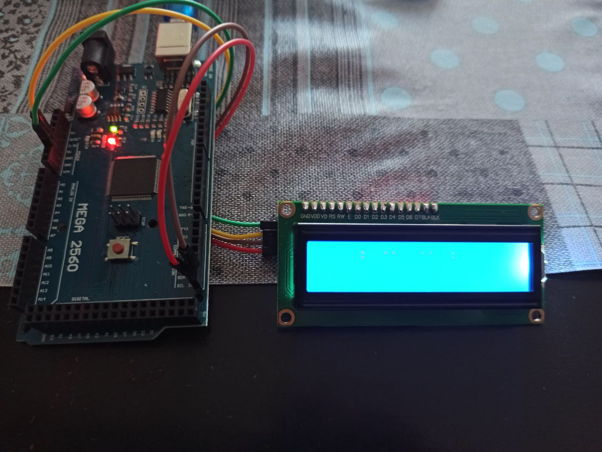

# Arduino Sketches

- [Joystick controlled servo [sketch]](/servo/joystick-controlled-servo.ino)

- [Remote and Ultrasonic sensor controlled servo [sketch]](/servo/remote-and-ultrasonic-sensor-controlled-servo.ino)

- [Clap controlled Servo [sketch]](servo/servo.ino)
- [Remote controlled Servo [sketch]](servo/remote-controlled-servo.ino)

- [Cat Dance Animation on LCD [sketch]](cat_dance_animation/dance_cat_animation.ino)

 
I2C LCD Connection 

- [Traffic Lights [sketch]](traffic_lights/traffic_light.ino)

  

- [Ultrasonic Sensor with LCD distance display [sketch]](ultrasonic_sensor/ultrasonic_sensor.ino)

Distance 7 cm   
 
Distance 4 cm
 

- [Water sensor with LCD sensor value display [sketch]](water_sensor/water_sensor.ino)

Initial sensor   
 
Sensor in water
 

